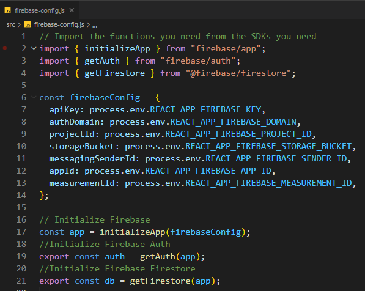
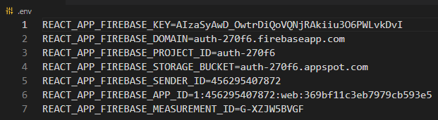

<!-- 
  IDEAS: Break down the course instructions into separate "md" files:
    1. Introduction/Project Overview and Setup/Installation
    2. Day 1 - Auth 
    3. Day 2 - Firestore
    4. Day 3 - Firestore Rules/Authorization
    5. Day 4 - ????
 -->
# Cars App - Project Instructions

## Overview

<!-- 
  TODO: Add an Overview 
  (What, Why, How? What will be the final outcome?) 
-->

## Setup

<!-- TODO: Fork and Clone Repo, npm install -->
1. Fork and Clone this repo.

2. In the main directory of this project, run `npm install` in your terminal.

3. Run `npm start` to see the React project on a live server.

### Firebase Configuration and .env

Let's first take a look at the "firebase-config" file in the main directory of the project. Notice that we are grabbing environment variables that should be coming from a ".env" file. You prepared a ".env" file in the pre-class assignment and you will be using that exact same file for this project, as it has the same credentials we will be using for this project. 

1. Copy the ".env" file from pre-class and paste it into the **main directory** of our new "Cars" project.

2. OR create a new ".env" file in the main directory and provide it the credentials from your Firebase console. 



>NOTE: The variable names in the ".env" file must match what you see inside the in the "firebase-config" file. If not, make sure that they are matching in order for this to work.

## Day 1 - Class 8 Project Instructions 

<!-- TODO: Add an Overview (What, Why, How? What will be the final outcome?) -->
We have a functioning FireBase sign up component and are adding a FireBase login page and protected routes to the FakeCars.com application. Once complete, you will be able to login to the app and remain logged in on page refresh and limit page access when logged out.

### Firebase Auth Configuration

Let' initialize our "Auth" instance in our project inside our "firebase-config" file.

1. At the top level, `import { getAuth } from "firebase/auth"`

2. Near the bottom, create a variable that stores the Firebase Auth instance we will export and use throughout our app. We will pass in our "app" instance that is connected to your account. `export const auth = getAuth(app);`

We can now make queries to your Firebase Auth instance in the components where we will need to import it and use it as a reference. The functions we will import from "firebase/auth" will need to reference our Auth instance as the first argument.

### SignUp


First thing we will do is sign up a new user. By now, you should have had a chance to see how the project runs on a live server. Navigate to the "Sign Up" page and you should see a form that is ready to use. The form has inputs that requires an email and a password before being submitted. Type in an email and password, then click the "Sign Up" button. You should see a console log with the current "registerEmail" and "registerPassword", then you will be *navigated* to "Home" page.

Take a look at the "SignUp" component and make sure you understand how everything is working and is connected. We are using code you should already be familiar with. We are using the `useNavigate` hook from "react-router-dom" and we have already included some `useState` variables to store the *state* of the email and password.

The form has a `onSubmit` event handler that points to a `signUp` function. This is where we will make a request to create a new user with provided email and password. We, of course, need to start by importing the required functions from the "firebase/auth" library and our "auth" instance from the "firebase-config" file.

1. At the top level, `import { auth } from "../firebase-config"`

2. At the top level, `import { createUserWithEmailAndPassword } from "firebase/auth"`

3. Now that we have the function we need, inside the "signUp" function, writer the code to create a new user with the email and password coming from the inputs.

4. Make sure to turn the "signUp" function to an asynchronous function by using async/await methods. Also use a try/catch block to catch any unexpected errors that may occur during the query.

```javascript
const signUp = async (e) => {
    e.preventDefault();
    try {
      const userCredential = await createUserWithEmailAndPassword(
        auth,
        registerEmail,
        registerPassword
      );
      console.log("userCredential.user", userCredential.user);
      navigate("/");
    } catch (error) {
      console.log(error.message);
    }
  };
```

5. The "createUserWithEmail" function returns something, so make sure you save the result from this asynchronous function into a variable. You can console log that variable to see the object that is returned. We will need to use this later set our current "user" *state* that will keep track if someone is logged in.

If the function is successful, Firebase Auth will save the users credentials of into local memory, the indexedDB. We now have access to that object by using other functions from "firebase/auth". This will help the app keep track if someone is currently logged in.

### GetAuth

So we have just signed up a new user, and we know that after we signed up, the users credentials, or the current user logged in object, is stored in the memory of our web application. We cannot really do anything with it at the moment because we have to use another Firebase Auth function to extract that user object from that local memory, the *indexedDB*.

We are going to be using `{onAuthStateChanged}` from `firebase/auth` Let's begin at the "App.js" component.

1. At the top level, `import { onAuthStateChanged } from "firebase/auth"`

2. At the top level, `import { auth } from "./firebase-config"`

3. We are also going to be using some React Hooks. At the top level, `import { useEffect, useState } from "react"`

4. Let's start by setting some *state* to keep track of a user if they are logged in. The initial state for this *state* will be null. We are going to use the `onAuthStateChanged` function to check for any current logged in user, otherwise it will stay null.

5. Create a `useEffect` hook where we will be using our `onAuthStateChanged` function inside of. `onAuthStateChanged` will return something to us, so make sure you assign a variable to the result of this function call. This function will take two parameters, the first is of course our "Auth" instance, the second will be a call back that will return that user object that is stored in the *indexedDb* memory. Make sure to console log the "currentUser". We will also set *state* to that of the user object: `setUser(currentUser)`.

6. Inside the `onAuthStateChanged` callback, after setting the user *state*, we want to call that variable we assigned to this function call. In previous lessons, we named this variable `unsub` because what is returned by that `onAuthStateChanged` function is a *unsubscribing* function that allows us to stop the `onAuthStateChanged` function from constantly monitoring our app for any other auth state changes. Make sure to invoke the variable/function: `unsub()`. 

```javascript
const [user, setUser] = useState(null)

useEffect(()=>{
  const unsub = onAuthStateChanged(auth, (currentUser) => {
    console.log("Current User: ", currentUser);
    setUser(currentUser)
    unsub()
  });
},[])
```

6. Whenever you refresh your page, this useEffect will run our `onAuthStateChanged`, and if there is a user object stored in the *indexedDB*, it will set our user *state* to that object of the the current user logged in.
  
  >Note: This useEffect will run only once when the app loads. `onAuthStateChanged` should stop monitoring for any other auth state changes since we will take care of that ourselves. This is just to check if there is currently a logged in user at start. 

We now have a way to keep track if someone is logged in at the moment our App loads. Like mentioned before, if someone has signed up, the "user" object of that person that signed up will be stored in *indexedDb*. It will stay in there until we delete it manually, or use another function from Firebase called `signOut`.

### SignOut

So now our app knows how to check if someone is currently logged in by checking the local memories *indexedDB*. Let's create a way to log that someone out by clicking the "Logout" button inside our "Navigation" component.

Let's start by looking at our "Navigation" component.

1. At the top level, `import { signOut } from "firebase/auth"`

2. Don't forget to `import { auth } from "./firebase-config"` at the top level.

3. Look for the "li" in within the component that has our "Logout" text. We are going to add an "onClick" property and pass in our `signOut` function for that event. We will have to pass in our "auth" instance to this `signOut` function so this onClick will have to be an *anonymous* function, or empty function. It should look like this:

```javascript
<li
  className="nav-list-item"
  onClick={async() => {
    await signOut(auth);
  }}
>
  Logout
</li>
  ```
  >Note: This will also be an asynchronous function call, so `await` the results.

4. Now when we refresh the page, we should see that the current is now `null`. That means we have successfully logged out.

5. We don't want to have to refresh the page every time, that is not practical, so lets pass our user *state* from "App.js" over to our "Navigation" component. We are going to pass both the "user" *state* and the "setUser" function that sets our state. We will currently only use "setState" but will later use the "user" state when we talk about conditional rendering later in this section.

```javascript
// Inside App.js
<Navigation user={user} setUser={setUser} />
```
6. Now that we have a way to set our "user" *state* in our navigation component, we want to set that *state* to null right after the `signOut(auth)` function: `props.setUser(null)`. Don't forget to pass in props to our "Navigation" component.

7. We also want to use `useNavigate` from `react-router-dom` to navigate our user to the "/login" page or maybe just "/" Home page.

```javascript
<li
  className="nav-list-item"
  onClick={async() => {
    await signOut(auth);
    props.setUser(null)
    navigate('/login')
  }}
>
  Logout
</li>
  ```
So we are now logging out our current user and also setting the "user" *state* of our app to `null` when that function is successful. Setting the user to `null` will be important when we want to render something conditionally, like our "Login" and "Logout" buttons or when we set up our "Protected" routes component.

### Login

We have successfully signed someone up, which also logs the user in, and we can also log that user out. We now need a way to log someone in if they have already signed up.

Let's start at the "Login" component. We currently have a form setup with a `onSubmit` event that points to a `login` function. Make sure you take a look at the form and understand how it is working before we move on.


1. At the top level, `import { signInWithEmailAndPassword } from "firebase/auth"`

2. Don't forget to `import { auth } from "./firebase-config"` at the top level.

3. Inside the `login` function, make a request to Firebase Auth to log someone in using the "loginEmail" and "loginPassword" they have entered. Just as the Firebase Auth function explicitly says, `signInWithEmailAndPassword`, we are going to provide the function with both the email and password. This function takes in 3 parameters, the first one being "auth", followed by the "email", then the "password". Makes sure to turn the `login` function to an asynchronous function and await the results of this `signInWithEmailAndPassword` function. Just like before, we also want to save the results of this function to a variable which we can then use. The result will be that same "user" object that is stored inside the local memories *indexedDb*.
```javascript
const login = async(e) => {
  e.preventDefault();
  let currentUser = await signInWithEmailAndPassword(auth, loginEmail, loginPassword)
  console.log(currentUser)
  navigate("/");
};
```

4. Although our memory knows of our currently logged in user, our app is still unaware. We need to pass the "setUser" function from the `useState` hook as props to this "Login" component. But the "Login" component is inside our "Router.js" component. We will have to drill our props into our "Router" component, then into our "Login" component. Begin at "App.js". Pass the `setUser` function as a prop to the "Router" component. Next, let's go to the "Router" component. We need to pass props to this component then pass those props again to our "Login" component. 

```javascript
// Inside App.js
<Router user={user} setUser={setUser} />

// Inside Router.js
<Route path="/login" element={<Login setUser={props.setUser} />} />
```

5. We should now have access to the props we passed down to the "Login" component from the "App" component by drilling the props down to it. Make sure to pass props as the parameter in the "Login" component and lets use that `setUser` component to save the results of our `signInWithEmailAndPassword`, which is our user object: `setUser(currentUser)`.

```javascript
const login = async(e) => {
  e.preventDefault();
  let currentUser = await signInWithEmailAndPassword(auth, loginEmail, loginPassword)
  console.log(currentUser)
  props.setUser(currentUser)
  navigate("/");
};
```

6. The `useNavigate` was already prepared for us in this component and should be the last thing to happen in this `login` function. Once a user has logged in successfully, they will be navigated to the "Home" component.

Awesome! We have now completed all the Authentication stuff surrounding our app and it should work pretty smooth now. We still have bits and pieces to implement, such as conditional rendering and our Protected Routes, we will cover that next.

If something is not working properly, go through the assignment again and make sure everything is correct.

### Conditional Rendering

So we can now keep track of any current user logged in to our app and we have *state* holding the value of that current user. We want to be able to conditionally render certain elements in our page based on whether someone is logged in our not.

For instance, our "Login", "Sign Up", and "Logout" buttons are all being displayed at the same time. We want this conditionally render the proper buttons whether someone is logged in or not. If someone is logged in, we should only see a "Logout" button among those three buttons mentioned. If some one is not logged in, than we want to be able to only see the option to either "Sign Up" or "Login", of those three buttons mentioned.

We will go into the "Navigation" component to set these conditional statements. Luckily for us, we should have already passed the "user* props to this component. Remember, the "user" props either has a user object of the current user logged in, or it is `null`, signifying that someone is logged in if the *state* has a user object or logged out if the *state* is `null`.

Inside the "Navigation" component:

1. We should already be passing in props, so lets use the "user" props which holds the *state* of the current user. Let's user a *ternary operator* to render only the "logout" button if *state* has a user object, otherwise, we want to render both the "Login" and "Sign Up" button if it is `null`.

```javascript
// Inside the "Navigation" component
{props.user ? (
  <li
    className="nav-list-item"
    onClick={async () => {
      await signOut(auth);
      props.setUser(null);
      navigate("/login");
    }}
  >
    Logout
  </li>
) : (
  <>
    <li className="nav-list-item">
      <Link to="/signup">Sign Up</Link>
    </li>
    <li className="nav-list-item">
      <Link to="/login">Login</Link>
    </li>
  </>
)}
```

2. Remember, if we are trying to return two JSX elements at once, we need to wrap that in one parent container since React expects only one Element to be returned at a time. In this case, I am using a fragment as the parent element to wrap both the "Login" and "Sign Up" button.

3. Test to make sure it works. When you login, the Navigation should change to reflect the "user" *state*. It should change again when you logout, as well.

Great job! Let's move on to protecting some routes using similar logic to allow access to a page only if a user is logged in.

### Protected Routes

We covered ProtectedRoutes in the pre-class, and we will be using that same logic in this code. Make sure you understand how that works and let's implement that functionality in our App. We will be protecting two routes, the "Dashboard" page and the "About" page. 

1. We will begin by creating a new component called "ProtectedRoutes.js".

2. The component will look just like the pre-class assignment:
```javascript
import React from "react";
import { Navigate } from "react-router";

const ProtectedRoutes = (props) => {
  const { component: Component, user, ...rest } = props;

  return (
    <>
      {user ? (
        <Component />
      ) : (
        <Navigate to="/login" />
      )}
    </>
  );
};

export default ProtectedRoutes;
```
>NOTE: If you are confused at how this looks, please look at the pre-class assignment where there is a descriptive explanation on what is going on in this component.

3. Lets import our "ProtectedRoute" component inside out "Router" component so that we can use it to protect certain routes. 

4. Inside the `<Route />` that renders our "Dashboard" component, we will instead pass in our "ProtectedRoute" component and pass the "Dashboard" component as a prop inside the "ProtectedRoute" component.

5. You will also need to pass the "user" *state* coming from props to the "ProtectedRoute" component so that we can use it to conditionally in the case that someone is logged in or not. If someone is logged in, it will render the component that we passed along, but if they are not logged in, they will navigated to the "/login" page. We are use `{Navigate}` from `react-router-dom` to navigate our user.
>NOTE: `{useNavigate}` and `{Navigate}` are two different things both from `react-router-dom`. `useNavigate` is a hook we can use inside our code to navigate someone, where `Navigate` is a component, which takes a `to="/"` attribute, called inside of the `return` of the current component. They work similar but have different usability.

6. We want to do the same thing for the "About" route. The routes should look like this:
```javascript
<Route
  path="/dashboard"
  element={<ProtectedRoutes user={props.user} component={Dashboard} />}
/>
<Route
  path="/about"
  element={<ProtectedRoutes user={props.user} component={About} />}
/>
```

We now have some protected routes that only allows access to users that are currently logged in to our App. Awesome!

### Almost forgot!
When the user signs up, our App *state* has no idea of our current user, it is only stored in local memory. Remember we have access to the "userCredential" after we sign them up, and we said we would be using this to let our app *state* know that we also logged this user in. Just like we have been passing the "user" *state* and the "setUser" function around to other components, we also want to pass this "setUser" function to the "SignUp" component. We are already passing it to out Router, which has access to all out other components, so lets also pass "setUser" to the "SignUp" component inside the "Router" component.

Inside "Router.js":
1. Pass the `setUser` function to the "SignUp" component.

2. Inside the "SignUp" component, be sure to pass in props to this component.

3. Inside your `signUp` function, use the `setUser` props to the result of the `createUserWithEmailAndPassword` function. It should look like this:

```javascript
const signUp = async (e) => {
    e.preventDefault();
    try {
      const userCredential = await createUserWithEmailAndPassword(
        auth,
        registerEmail,
        registerPassword
      );
      console.log("userCredential.user", userCredential.user);
      props.setUser(userCredential)
      navigate("/");
    } catch (error) {
      console.log(error.message);
    }
  };
```

Our app authentication is now smoothly operating. Make sure the functionality of you app is working properly.

## Day 2 - Class 9 Project Instructions 

### Overview

At this point, we have already implemented Firebase Auth to our project and can keep track if someone is logged in or not. By knowing if someone is logged in, we are able to provide to them web pages that would otherwise be denied. Along with that, we also want to restrict the ability to do certain actions, such as create or update data. We setup these ProtectedRoutes in the previous section, and only if we are logged in, should we be able to access the "Dashboard". 

The "Dashboard" page, once we are done building it, will allow us to *Create*, *Update*, and *Delete* certain data. We must first begin by creating a new ***collection*** of *cars* in our Firestore instance which will replace the cars data in the current project. The *data* is currently coming from the `./cars.json` file. This *carsData* can be seen being imported at the top level of the "Dashboard" page, which comes from our `./cars.json` file/

Make sure you spend some time looking at the "Dashboard" component and getting to understand how everything is all connected. Look at all the other components that are being called inside this component such as the "Chart", "Total", "EditCar", and "AddCar" component. What are all those components doing and how is it all connected? Make sure to click around in the live React server and see how the app runs.

### writeBatch
When entering data to our Firestore DB, we can enter it in manually using the Firestore console, one by one, *OR* we can create a *batch* that will create multiple documents at once directly from our `./cars.json` file. Whichever you choose, the code for the `writeBatch` method will be provided here.

Let's start by adding our hard-coded JSON data to our Firestore database. To do this we are going to need to create a *batch* using Firestore's "writeBatch" function. This allows us to write multiple documents at once, and will only succeed if all documents were successfully written. We will put this code in App.js and ***ONLY use it once***, since we only want to upload the information one time. If this runs a second or third time, you would have written about 40 or 60 of the same cars, which we do not want. The function will be inside a "useEffect" hook with an empty dependency, which means it will run only at the initial render. 

1. Paste the code snippet below into the "./App.js" file. Make sure you place it inside the Functional Component, otherwise you will get an error. 
    ```javascript
    useEffect(()=>{

    const addCarsCollection = async() => {
        const collectionRef = collection(db, 'cars')
        const batch = writeBatch(db)
        cars.forEach(object => {
        const docRef = doc(collectionRef)
        batch.set(docRef, {
            ...object,
            id: docRef.id
          })
        })
        await batch.commit()
        console.log('done')
    }

    addCarsCollection()
    },[])
    ```

2. Start your React project with `npm start`, and make sure to check the console on the browser. You should be looking for a "done" to print in the console. That will mean our *batch* was successful.

3. Delete the code snippet from "./App.js". ***We only want this to run once, and only once***.

We should now have a new collection of "cars" in our Firestore console, which comes directly from our "./cars.json" file. Now we can replace the data in our project with real data from our database. In order to do this, we will begin with creating a query to *Read* data from our Firestore DB.

### Read

With our new Data in Firestore, we are going to create a query to *Read* that data from our "cars" collection inside our Firestore DB. Once we get that data, we will then save it to some *state* and replace our current data from the "./cars.json". We are going to create this *state* at the most **Parent** element in our project so that we can pass this *state* along to other components as *props*. These other components will depend on this "carsData" *state*.


1. Inside the "App.js" component, we want to start by adding some *state* using the `useState` hook. You will want to call that *state* "carsData" since it will be easier to replace the current data being used in the project. We will later be saving the results from our Firestore query into "carsData" *state* by using the `setCarsData()` function that we from the `useState` hook.

```javascript
const [carsData, setCarsData] = useState([])
```

2. Next, be sure to import our "db" instance from our "firebase-config" file and the necessary function from the "firebase/firestore" library at the top level. We will need to import "collection" and "getDocs" from "firebase/firestore". Create a function, inside a `useEffect` hook, that will query Firestore to *Read* the entire *collection* of *documents* from the "cars" collection. 

```javascript
useEffect(() => {
const getCars = async () => {
    const documents = await getDocs(collection(db, "cars"));
    const documentData = documents.docs.map((document) => {
    return {
        ...document.data(),
        id: document.id,
    };
    });
    setCarsData(documentData);
};
getCars();
}, []);
```

3. Now that we have "carsData" saved to *state* we want to pass this along to all the other components that are going to need it. In this case, pass the "carsData" *state* into our "Router" component, since the "Router" component has access to all the other components. We will then pass along that *state* to other components that will require it. 
>NOTE: This is considered *prop drilling*, and is entirely ok. It can at times be hard to keep track of all these "props", and eventually we will discuss a solution to *state management*. For now, it is important to know how props are passed around to other components.

4. Pass the "carsData" *state* to these components that will depend on it: "Car", "Home", and "Dashboard". The "AddCar" component does not need it, and the "EditCar" component already has "carsData" being passed to it as a prop from the "Dashboard" component.

5. Make sure to go to each of those components and update the data with the "carsData" coming from "props". Don't forget to pass along props as the parameter in those components. For example, inside our "Dashboard" component, pass *props* in the functions parameter to get access to the props being passed into this component. Next, go down to where "carsData" is being *mapped* and change "carsData" to `props.carsData`. Look for the *comments* in the "Dashboard" component.

6. You will need to delete the `import carsData from "./cars.json"` since it has been replaced. This import can be found inside our "Car", "Home", and "Dashboard" component at the top level.

7. Inside our "Dashboard" component, we also have 2 components that will depend on the "carsData" *state*: "Chart" and "Total". Make sure to pass along that "carsData" *state* to these components as well.
    > Note: As you may have seen, "Chart" is a pie chart that is displayed inside the Dashboard page. We are using the "react-minimal-pie-chart" *npm module* for this feature, which makes it easy to create simple pie charts. Make sure to look at the documentation for this package to see how it works. Provided for you is a simple example. 

8. Inside our "Chart" component, you will need to create two variables to keep track of the "length" of cars that have Horsepower above and below 200. This will dynamically change as your "carsData" does.

9. Inside our "Total component, you will just need to provide the length of the whole "carsData" array to make the total number dynamic as well.

Our project is now getting data from our Firestore database and works dynamically across the app. Great Job! 

### Create
Now we need to *Create* a document and store it to our Firestore database. We will then update our React state of these changes, without having to query another *Read*, saving us an unnecessary request.

By now you should have seen a button on the "Dashboard" page which brings up a form. This "AddCar" component is using the "Dialog" component straight from MUI, which looks very neat. This dialog brings up a form where we can provide details for the new car we want to add. It currently only console logs our new car object. You are going to build the function to make a Firestore request to create a new *document*. You will then update carsData of the new "car" we just added to our DB. You will want to pass the "setCarsData" function from our `useState` hook as props from the "App.js" component, just like we did with "carsData"

1. Inside our "AddCar" component, let's begin by importing our "db" instance from our "firebase-config" file and the necessary function from the "firebase/firestore" library at the top level.

2. Look at the "handleSubmit" function, it currently only has a console log and a "handleClose" function which will close the Dialog window that pops up. Test this "onClick" event to make sure you get your car details in the console in your live React development server. The log should print an object with a keys/value pairs whose values are all empty strings and an empty array, unless you typed in some details inside your form before hitting the "Create New Car" button.

3. Lets create our *create* document query. Make sure to create the collection reference first, then the document reference with the collection reference we created. This allows us to get the "id" of the document up-front so that we can store the "id" in the actual document. You will also need to provide that id inside the `setDoc` query when you pass in the object as the second parameter. That's if you want to provide the "id" to the actual document.

    ```javascript
    const collectionRef = collection(db, "cars");
    const docRef = doc(collectionRef);
    await setDoc(docRef, { ...car, id: docRef.id });
    ```
    >NOTE: We can substitute "addDoc" for "setDoc" if knowing the document id up-front is not as important. Usually, we do not need to store the "id" inside the document as the document title is the actual "id". "addDoc" will not need a "doc" reference, and instead, the "collection" ref will suffice.

    ```javascript
    const collectionRef = collection(db, "cars");
    const newDoc = await addDoc(ref, car);
    ```

4. Make sure to turn the function to an asynchronous function by using async/await methods. Also use a try/catch block to catch any unexpected errors that may occur during the query.

5. Update "carsData" *state* to include this new document/object we created. Make sure to pass the "setCarsData" function, from our "useState" hook from "App.js", as props to this component. This should update your current list without having to make another query to *Read* the list again. Alternatively, you can just make another request to Read the data.

6. We also want to set the "cars" *state* inside the current component to the initial state of just empty strings and an empty colors array. This will clear the inputs in the form.

7. The last function call in this "handleSubmit" should be the "handleClose" function call to close the Dialog.

***The function will look like this:***

```javascript
const handleSubmit = async () => {
    console.log("This is your new car:", car);
    // Create Firestore query function here

    try {
      const collectionRef = collection(db, "cars");
      const docRef = doc(collectionRef);
      await setDoc(docRef, { ...car, id: docRef.id });

      props.setCarsData([...props.carsData, { ...car, id: docRef.id }]);

      setCar({
        id: "",
        Name: "",
        Miles_per_Gallon: "",
        Cylinders: "",
        Displacement: "",
        Horsepower: "",
        Weight_in_lbs: "",
        Acceleration: "",
        Year: "",
        Origin: "",
        Colors: [],
      });

      console.log("New Car Added");
      handleClose()

    } catch (error) {
      console.log("ERROR:", error);
    }
  };
```

8. If successful, we should see our new "car" inside both our Firestore DB and our React app. Check to make sure both have been updated.

9. Our Chart and Total should also be updated to represent the data we provided.


Great Job! We can now create data and store it to the Firestore DB while also updating our current React state.

### Delete
Now that we can *Create* some data, let's get into *Deleting* some of that data. This function should be simpler than the rest.

Inside our "Dashboard" component, look for the "handleDelete" function. This function takes in a parameter we called "anchor". This will be the "anchorElement" which is coming from the *MoreVert* icon that is clicked to bring up the the little *Menu*.  *Menu* is another MUI component, so be sure to check it out to understand it better. It works by displaying the *menu* on a specific element, the *anchor element*, in which we want the menu to pop up at. We can pass some string value inside that *anchor element* which we can then use for whatever we may need. In this case, we are passing the car's id as the id property so we know what document to delete by its "id". The "carId" comes from the anchor's id property, we access it by calling `anchor.id`. Let's click the delete icon on our live React server and check the console log inside this event function call so that we can see the values we are talking about. Click other *Delete* icons that comes from the *MoreVert* icon from different rows in the list. The "id" should be changing along for every different row we click.
    
>Note: The *MoreVert* icon is the 3 dots icon under the "edit" column. When clicked, it will display a menu with 2 other icons, a "Delete" and "Edit" icon. 

1. Now that we know the "id" of the document we want to *Delete*, lets build the function to carry out this *Delete* operation. Let's start by importing the necessary functions from "firebase/firestore" and our "db" instance from the "firebase-config" file. We are going to need "doc" and "deleteDoc" from the Firestore library.

2. Make sure to also turn this "handleSubmit" function to an asynchronous function, "async/await". Also, add the try/catch block as well.

3. The document you are going to reference should be coming dynamically from the "id" set inside the anchor. So the function should look like this: `await deleteDoc(doc(db, "cars", anchor.id))`

4. Just like before, we want to make sure we also update the state of these changes. We want to *filter* our "carsData" for any car whose id that matches the "id" of the car we just deleted. We do this by making a shallow copy of "carsData", use the *filter* method to filter out the car whose id matches the id coming from the selected "anchor", then "setCarsData" to the result of the filter method used. Alternatively, you can just make another *Read* request.

5. The last function call in this "handleDelete" should be the "handleClose" function. This function closes the *menu* with the delete and edit icons by setting the "anchorEl" *state* to null.

***Your function should look like this***
```javascript
  const handleRemove = async (anchor) => {
    console.log(anchor.id);
    try {
      await deleteDoc(doc(db, "cars", anchor.id));
      const newCarsData = props.carsData.filter((car) => car.id !== anchor.id);
      props.setCarsData(newCarsData);
      handleClose();
    } catch (error) {
      console.log("ERROR:", error);
    }
  };
```

We have implemented "Read", "Write", and "Delete", oh my! Next operation to implement is "Update".

### Update

Now for updating, we will use a lot of what we just covered to make this happen. We again will be updating documents based on the "id" that is selected, which also comes from the "anchorEl". This time, we are actually passing the "setAnchorEl" function from the "useState" hook so that we can set it to "null" at the end of our *Update* operation. We are also passing "carsData" so that we can filter our carsData inside the "EditCar" component to get the details of the car we are trying to update. The last property we are passing is the "id" that is coming from the anchor itself.

If you look at where the "EditCar" component is being called, closer to the end of the "Dashboard" component, you will see the 3 different properties we just mentioned. The "carId" property has this unique "?" in the value, right before ".id". This question mark checks to see if this anchor even exists, otherwise it just ignores it. The anchor is set to null, initially, but once we click the "MoreVert" icon, the "anchorEl" object exists, and inside of that we have the "id" of the element row we clicked. So, using that "?" mark after an object checks of its existence, otherwise, ignores it. 

Alright, now that we know what properties are going into this "EditCar" component, and we know what "id" we want to edit, let's go into the "EditCar" component and create our *Update* function.

By now, you should see that our Update icon, when clicked, brings up a Dialog with a bunch of inputs, much like the "AddCar" component. The difference is that the inputs are already filled in with the details from the car we selected to *edit*. Other than that, these two components are very similar.

1. Start by importing the required functions from `firebase/firestore` and our "{db}" instance from the "firebase-config" file. We will need to use `{doc, updateDoc}` from the firestore library.

2. Inside of the "EditCar" component, we can see that we are already using the props we are passing through, take a look through this component and make sure everything make sense before moving on.

3. Inside the "handleSubmit" function, this is where you will be making your Firestore query. We currently log the "car" *state* and the "id" of the car selected to the console when we click the "Save Changes" button. Make sure to use both the "car" *state* and "props.carId" when creating your query.

4. Make sure to turn the function to an asynchronous function by using async/await methods. Also use a try/catch block to catch any unexpected errors that may occur during the query.

5. Update "carsData" *state* to include the changes we made. Make sure to pass the "setCarsData" function, from our "useState" hook from "App.js", as props to this component. This should update your current list without having to make another query to *Read* the list again. Alternatively, you can just make another request to Read the data.

6. We do not need to update the "car" *state* that lives inside the "EditCar" component since the Component will close after we "Save the Changes" and will again change if we decide to update another car.

7. The last function call in this "handleSubmit" should be the "handleClose" function call to close the Dialog and it also sets the "anchorEl" *state* to "null".

***Your function should look like this***
```javascript
const handleSubmit = async () => {
try {
    const docRef = doc(db, "cars", props.carId);
    await updateDoc(docRef, car);
    const carIndex = props.carsData.findIndex(
    (car) => car.id === props.carId
    );
    const newCarsData = [...props.carsData];
    newCarsData[carIndex] = car;
    props.setCarsData(newCarsData);
    handleClose();
} catch (error) {
    console.log("ERROR:", error);
}
};
```

8. If successful, we should see our updated "car" inside both our Firestore DB and our React app. Check to make sure both have been updated.


## Day 3 - Class 10 Project Instructions 
